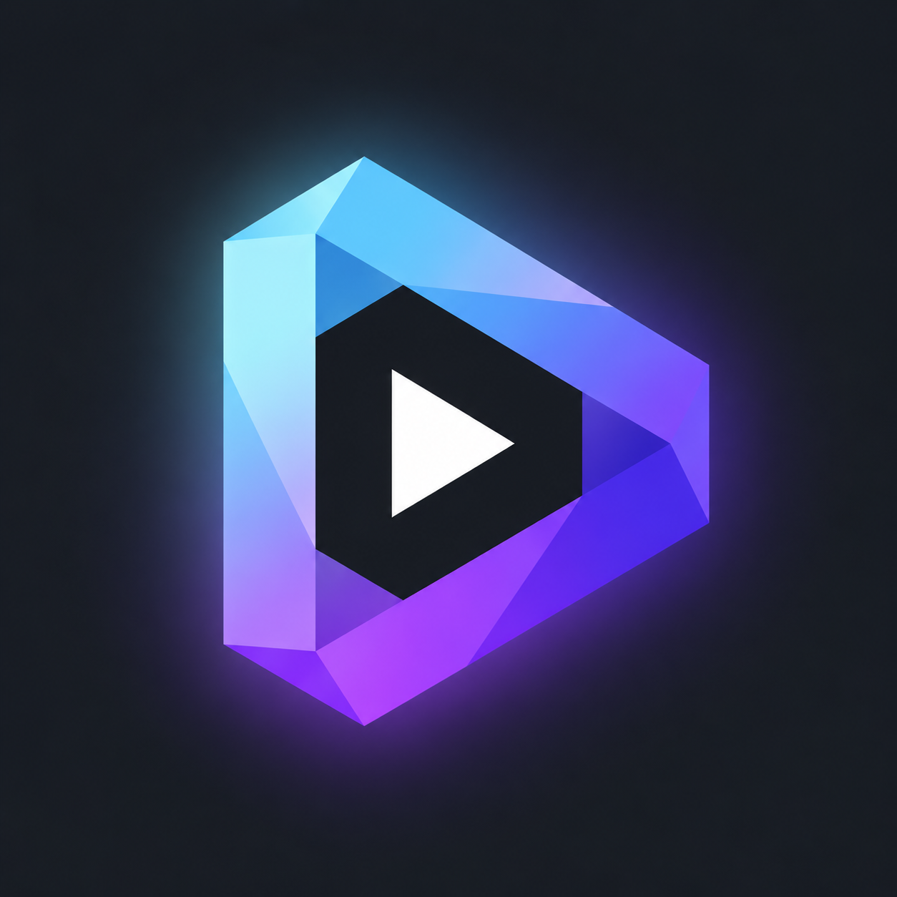

<div align="center">

  

  <h1>Nuvio Reshaped for TV</h1>

  <p>
    A community fork of <a href="https://github.com/NuvioMedia/NuvioTV">Nuvio TV</a> for Android TV and Google TV.
    <br />
    Everything you know from Nuvio, plus subtitles that sync themselves, instant seeking with previews, Live TV and a calmer, more cinematic player. Tuned to stay light on low-end TVs.
  </p>

  [Download](https://github.com/DavidVamaiotu/NuvioTV-Reshaped/releases) · [Phone version](https://github.com/DavidVamaiotu/NuvioMobile-Reshaped) · [Official Nuvio](https://nuvio.tv)

</div>

## What's different from Nuvio

Nuvio Reshaped tracks official Nuvio TV closely and only adds on top. Every addition lives on its own page under **Settings > Nuvio Reshaped**, and the extras that change how Nuvio looks or behaves are off until you turn them on.

### Subtitles

- **Subtitle AutoSync.** When playback starts, your preferred add-on subtitle is compared against the stream's embedded subtitles and shifted into place automatically. Only confident matches are applied.
- **Sync to audio.** When there's nothing to compare against, AutoSync can align the subtitle by listening to the dialogue, with an optional on-device speech model for English audio.
- **Secondary language.** AutoSync also works for a second subtitle language.
- **Bubble notifications.** Optional frosted-glass bubble that shows AutoSync progress and results instead of plain toasts.
- **Custom subtitle fonts.** Scan a QR code on the TV and upload a `.ttf` or `.otf` font from your phone.

### Player

- **Seek previews.** A thumbnail above the seek bar while you skip through a film, made on the TV from the video you're already watching. No extra downloads, and no work while the film is playing.
- **Seek buffer.** Reads ahead to a temporary file on disk so jumping forward is instant. Nothing is kept once you close the player.
- **Volume boost.** Nuvio's audio amplification is shown as a percentage up to 200%, with a red-tinted bar, and peaks are softened so boosted dialogue doesn't crackle.

### Browsing

- **Pill navigation.** An optional glass pill across the top for Home, Search, Library and Settings, fully usable with the D-pad.
- **Streams that fit your connection.** Learns your real playback speed and moves streams that are likely too heavy further down, keeping your add-on's order otherwise.
- **Live TV.** Add M3U, Xtream or Stalker playlists from your phone by scanning a QR code, then watch with a programme guide in Nuvio's own player. Zap with up and down or CH+ and CH-, and press left for the channel list.

## Get it

Download the APK from [Releases](https://github.com/DavidVamaiotu/NuvioTV-Reshaped/releases). There are two channels:

- **Stable** follows the official Nuvio TV stable release.
- **Beta** follows the official Nuvio TV beta and gets new fork features first.

Nuvio Reshaped installs as **Nuvio RS**, next to the official app, so you can keep both. Once installed, it checks this repository for updates and offers them in the app on the channel you pick.

## Build from source

Development requires Android Studio, a JDK and the Android SDK.

```bash
git clone -b subtitle-autosync https://github.com/DavidVamaiotu/NuvioTV-Reshaped.git
cd NuvioTV-Reshaped
./gradlew :app:assembleFullDebug
```

`subtitle-autosync` is the beta branch and `subtitle-autosync-stable` the stable one. The app is built with Kotlin, Jetpack Compose, TV Material 3 and Media3.

## Credits

Nuvio Reshaped is built on [Nuvio](https://nuvio.tv) by the [NuvioMedia](https://github.com/NuvioMedia) team, who do the real work on the app. It is not an official Nuvio release, so please report problems with this fork here rather than to Nuvio. If you enjoy it, consider [supporting Nuvio](https://nuvio.tv/support).

## License

[GNU General Public License v3.0](./LICENSE), the same as upstream Nuvio.
